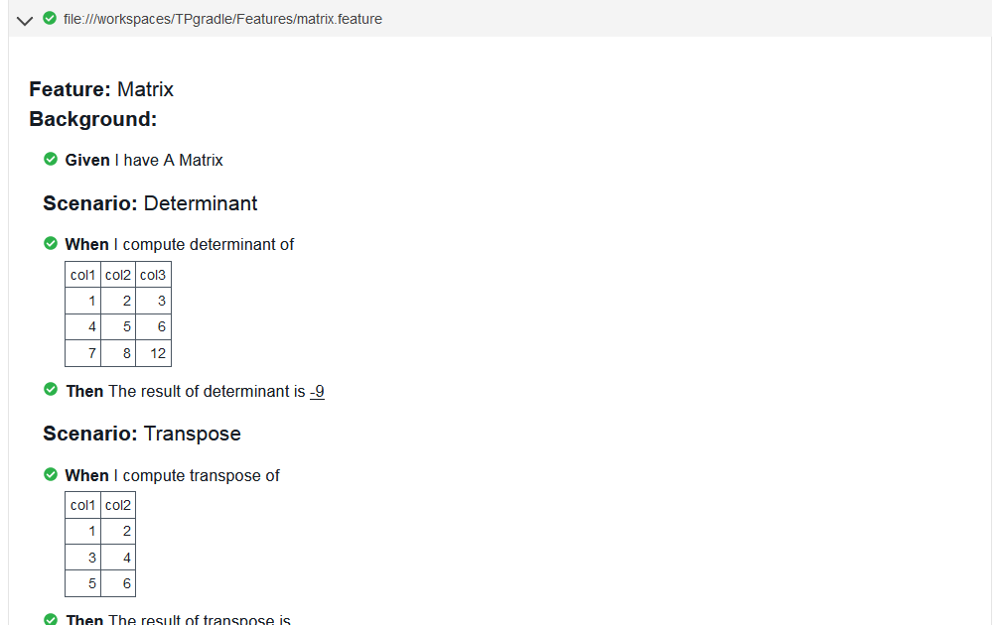
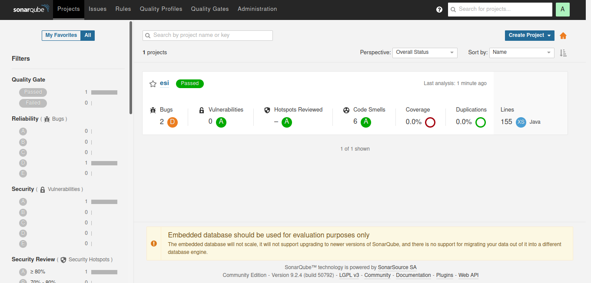
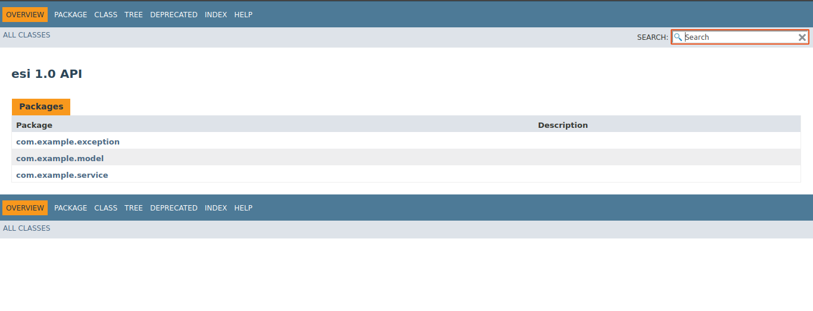

# TPgradle
  
## run this repository on cloud vscode IDE by clicking:
  
You need to login with your github account  

will automatiqually setup SonarQube Server   
  
  
## Mes TPs précédents  

Junit : https://github.com/CastHash532/TPtests  
Selenium : https://github.com/CastHash532/TPselenium  
Cucumber : https://github.com/CastHash532/TPcucumber  
Sonarqube: https://github.com/CastHash532/SonarQube    

## Screenshots des étapes  
  

### 1. Rapport de tests Cucumber 
  
 
  

  
### 2. Code review  
  

  
### 3. Documentation  
  

  

### 4. Déploiement du Jar  
  
  
### 5. Slack  
  

